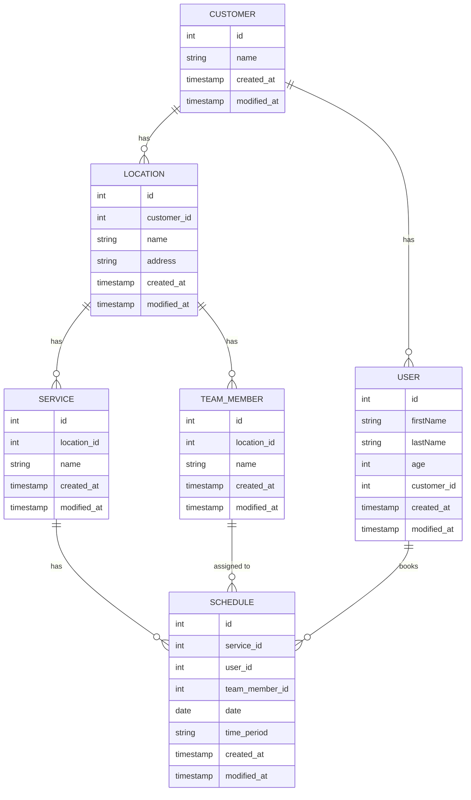

# Database Schema

```mermaid
erDiagram
    CUSTOMER {
        int id
        string name
        timestamp created_at
        timestamp modified_at
    }
    LOCATION {
        int id
        int customer_id
        string name
        string address
        timestamp created_at
        timestamp modified_at
    }
    SERVICE {
        int id
        int location_id
        string name
        timestamp created_at
        timestamp modified_at
    }
    TEAM_MEMBER {
        int id
        int location_id
        string name
        timestamp created_at
        timestamp modified_at
    }
    SCHEDULE {
        int id
        int service_id
        int user_id
        int team_member_id
        date date
        string time_period
        timestamp created_at
        timestamp modified_at
    }
    USER {
        int id
        string firstName
        string lastName
        int age
        int customer_id
        timestamp created_at
        timestamp modified_at
    }

    CUSTOMER ||--o{ LOCATION : "has"
    LOCATION ||--o{ SERVICE : "has"
    LOCATION ||--o{ TEAM_MEMBER : "has"
    SERVICE ||--o{ SCHEDULE : "has"
    USER ||--o{ SCHEDULE : "books"
    TEAM_MEMBER ||--o{ SCHEDULE : "assigned to"
    CUSTOMER ||--o{ USER : "has"
```
